# Cookbook
###### Lista przepisów ugotowanych chociaż jeden raz 

## Dania mięsne:
-  [Wieprzowe roladki pieczarkowo-porowe](meats/Wieprzowe_roladki_pieczarkowo-porowe.md)
- 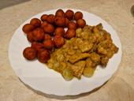 [Kurczak w sosie musztardowo-miodowym](meats/Kurczak_w_sosie_musztardowo-miodowym.md)
- 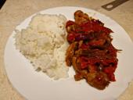 [Kurczak po wietnamsku](meats/Kurczak_po_wietnamsku.md)
- 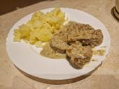 [Polędwiczka w sosie kurkowym](meats/Poledwiczka_w_sosie_kurkowym.md)
- 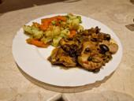 [Polędwiczka a'la Marbella](meats/Poledwiczka_a-la_Marbella.md)
- 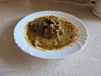 [Karkówka w sosie własnym](meats/Karkowka_w_sosie_wlasnym.md)
- 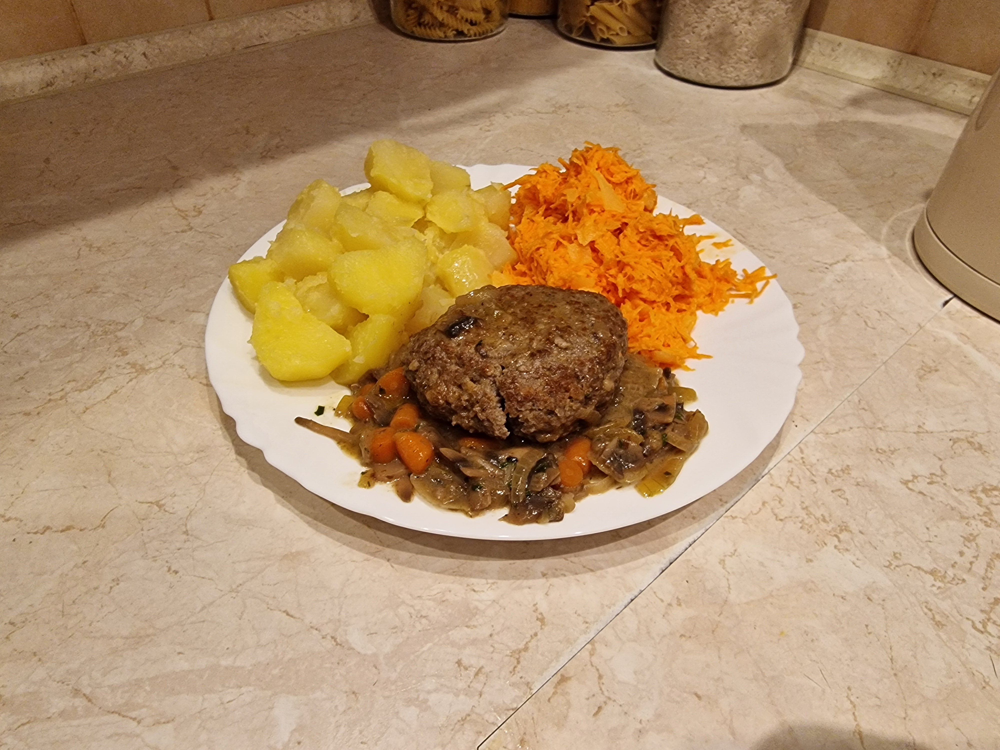 [Stek Salisbury](meats/Stek_Salisbury.md)
-  [Ryba po Grecku](meats/Ryba_po_Grecku.md)
- 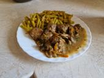 [Klopsiki w sosie pieczarkowym](meats/Klopsiki_w_sosie_pieczarkowym.md)
- 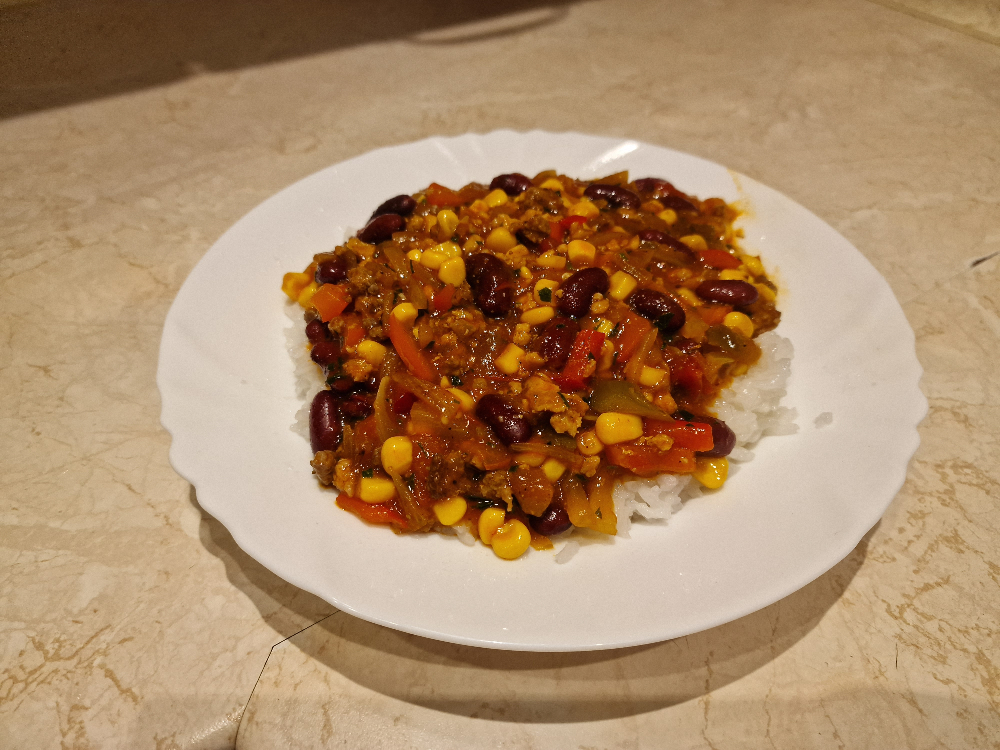 [Chili con carne](meats/Chili_con_carne.md)

## Dania bezmięsne:
- 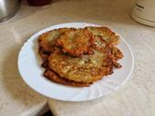 [Placki ziemniaczane](vegs/Placki_ziemniaczane.md)

## Zupy:
- 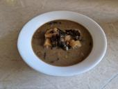 [Barszcz grzybowy](soups/Barszcz_grzybowy.md)

## Dodatki:
- 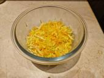 [Surówka azjatycka](sides/Surowka_azjatycka.md)
- 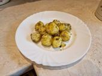 [Pieczone ziemniaki](sides/Pieczone_ziemniaki.md)

## Przystawki:
- 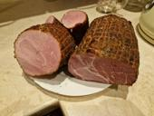 [Wędlina peklowana](starters/Wedlina_peklowana.md)
-  [Pasztet wieprzowo-drobiowy z wędzonką](starters/Pasztet_wieprzowo-drobiowy_z_wedzonka.md)

## Desery:
-  [Gofry](desserts/Gofry.md)
-  [Biszkopt tortowy](desserts/Biszkopt_tortowy.md)
-  [Kopiec kreta](desserts/Kopiec_kreta.md)
-  [Ciasto 'Mandarynka'](desserts/Ciasto_-Mandarynka-.md)
-  [Sernik pistacjowy](desserts/Sernik_pistacjowy.md)

## Przetwory:
-  [Ketchup](preserves/Ketchup.md)
- 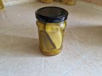 [Ogórki kanapkowe](preserves/Ogorki_kanapkowe.md)

---
### Stan przepisów w trakcie przygotowania:
- ✔️ - wykonane
- ❓ - posiadane w formie tymczasowej
  
| Składniki | Przepis | Zdjęcie | Nazwa | 
| :-: | :-: | :-: | --- |
|  |  |  | Wieprzowe roladki pieczarkowo-porowe |
| ✔️ | ✔️ |  | Pasztet wieprzowo-drobiowy z wędzonką |
| ✔️ | ✔️ |  | Gofry |
|  |  |  | Biszkopt tortowy |
|  |  |  | Kopiec kreta |
|  |  |  | Ketchup |
|  |  |  | Ryba po Grecku |
|  |  | ❓ | Ciasto 'Mandarynka' |
|  |  | ❓ | Sernik pistacjowy |
