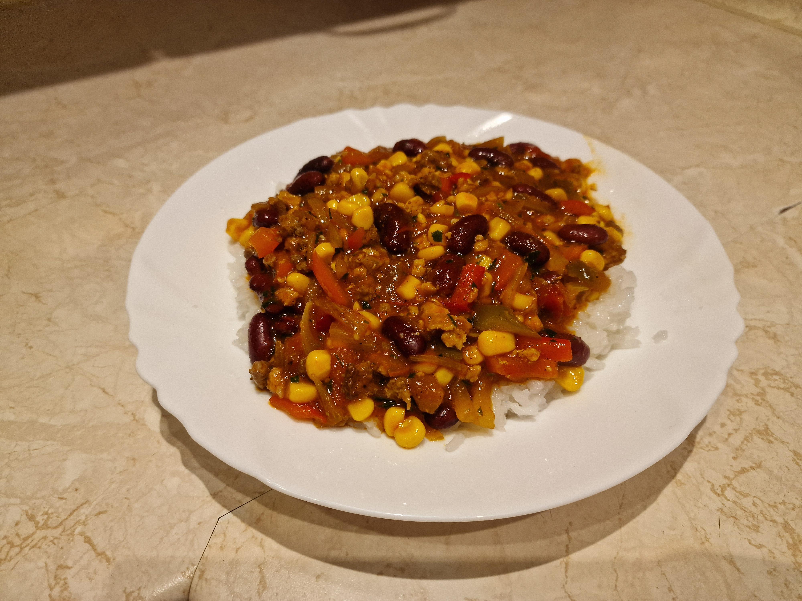

# Chili con carne

### Składniki
- 500g sosu meksykańskiego z warzywami (1 słoik, preferowany Łowicz)
- 450g mięsa mielonego wołowego lub wołowo-wieprzowego
- 150ml wody
- 1 puszka fasoli czerwonej (240g netto)
- 1 puszka kukurydzy (220g netto)
- 1 duża cebula
- 1 duża papryka
- 15 plastrów jalapeño
- 15+10ml smalcu
- 15ml natki pietruszki
- 10ml sriracha
- 5ml lubczyku suszonego *lub* 2 duże liście świeżego
- 1 duży ząbek czosnku
- 5ml soli
- 5ml pieprzu
- 4ml kminku
- 3ml majeranku
- 1/2 kostki rosołowej drobiowej

### Przygotowanie
1. Fasolę i kukurydzę odcedzić z zalewy (fasoli nie płukać).
2. Przyprawy zmielić, natkę (i ew. lubczyk) posiekać drobno.
3. Cebulę pokroić w połówki piórek, paprykę w paski 0.5x3cm, jalapeño w ćwiartki, czosnek zmielić nożem lub przez praskę.

### Gotowanie
1. Na wysokim ogniu rozgrzać patelnię; roztopić 15ml smalcu i podsmażyć mięso, starając się osiągnąć jak najlepszy kolor, na ostatnie 30 sekund smażenia dodać przyprawy oraz czosnek.
2. Mięso przełożyć z patelni do garnka, w miarę potrzeby zdeglasować patelnię odrobiną wódki; dodać sos, a do słoika po sosie wlać wodę oraz kostkę rosołową, wstrząsać aż do rozpuszczenia kostki oraz resztek sosu, dolać do garnka oraz zagotować.
3. Na patelni roztopić resztę smalcu i dodać cebulę, podsmażać aż ta zacznie się karmelizować.
4. Do cebuli dodać paprykę, jalapeño oraz kukurydzę, podsmażać aż papryka zacznie mięknąć.
5. Warzywa z patelni, fasolę oraz natkę dodać do sosu z mięsem, dusić na najmniejszym ogniu pod przykryciem przez 10 minut.

### Uwagi
Podawać na gorąco z ryżem lub pieczywem.\
Można udekorować łyżką kwaśnej śmietany oraz świeżą natką pietruszki.\
Przepis daje 4 porcje.
