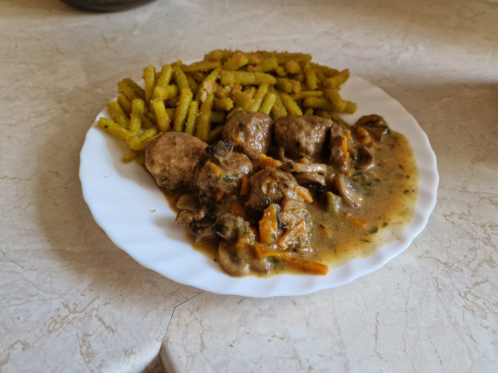

# Klopsiki w sosie pieczarkowym

### Składniki
- 0.4kg mięsa mielonego wieprzowo-wołowego
- 250ml wody
- 15 średnich pieczarek
- 1 duża cebula
- 1 średnia marchewka
- 60ml sosu sojowego
- 1 jajko
- 45ml śmietanki +30%
- 30ml mleka
- 25ml bułki tartej
- 20ml natki pietruszki
- 15ml smalcu
- 7.5ml oleju
- 5ml lubczyku suszonego *lub* 2 duże liście świeżego
- 4+0.5ml soli
- 4ml pieprzu
- 1/2 kostki rosołowej drobiowej
- 2ml gałki muszkatołowej
- 2ml majeranku
- 2ml chilli cayenne
- 1ml czosnku suszonego
- 1ml cebuli suszonej
- 1ml papryki wędzonej
- 1ml tymianku
- 1ml cząbru

Dodatkowo mąka do obtaczania - około 4-6 łyżek.

### Przygotowanie
1. Suche przyprawy, oprócz 0.5ml soli i chilli cayenne, zmielić w młynku.
2. Bułkę tartą namoczyć mlekiem, wymieszać na gładką masę.
3. Pieczarki umyć, pokroić w grube (4-5mm) plastry; cebulę pokroić w pół-piórka (krótsze), marchew w cienkie paski lub zetrzeć na grubych oczkach.
4. W wodzie rozpuścić kostkę rosołową, resztę soli i chilli cayenne oraz sos sojowy.
5. Natkę (oraz ewentualnie lubczyk) zsiekać.
6. Mąkę do obtaczania wysypać na płaski talerz.

### Gotowanie
1. Mięso wymieszać ze zmielonymi przyprawami, namoczoną bułką oraz jajkiem na jednolitą masę.
2. Z masy mięsnej formować kuleczki, używając czubatą łyżkę stołową mięsa na każdy; przygotowane klopsiki obtoczyć w mące.
3. Olej wymieszać na patelni ze smalcem, rozgrzać na średnim ogniu; podsmażać klopsiki, tak aby zabrązowić z każdej strony.
4. Klopsiki przełożyć do garnka; na patelnię wsypać cebulę i podsmażać aż ta zacznie się karmelizować.
5. Dodać pieczarki i marchew, podsmażać do czasu aż pieczarki zaczną się szklić, po czym zmniejszyć gaz i dusić pod przykryciem przez 5 minut.
6. Warzywa przełożyć do klopsików, zalać bulionem i dusić przez 30 minut, mieszając kilka razy.
7. Dodać śmietankę i zioła, dusić jeszcze 5 minut.

### Uwagi
Przepis daje 3-4 porcje.\
Podawać na gorąco z ziemniakami, lub kaszą.\
Mąka w której obtoczone są klopsiki powinna wystarczyć do zagęszczenia sosu; klopsiki należy dobrze mieszać, tak aby mogła się wymieszać z sosem.
