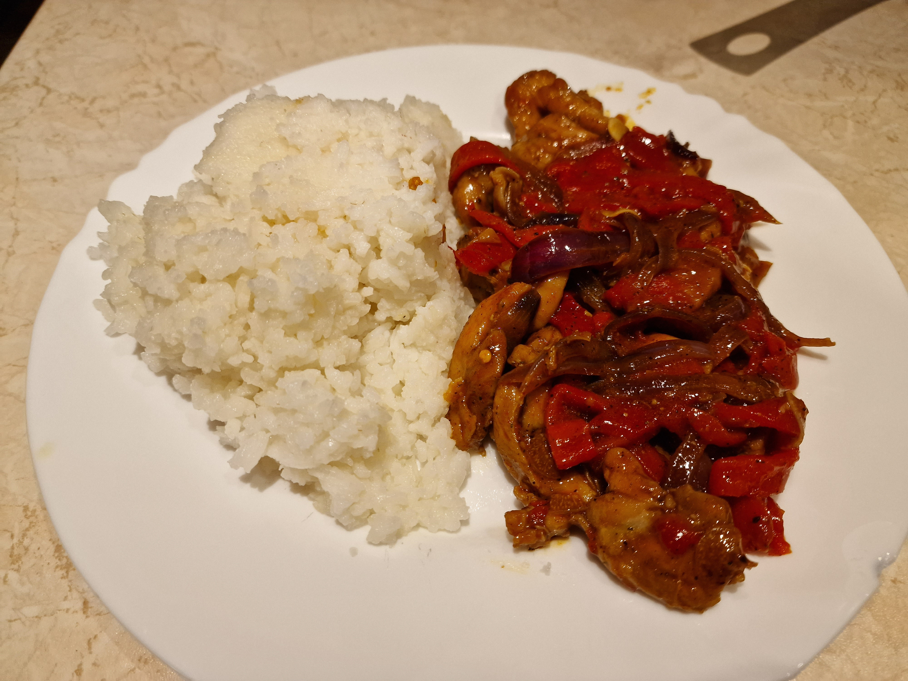

# Kurczak po wietnamsku

### Składniki
- 0.5kg mięsa z udek kurczaka
- 200g papryki konserwowej
- 2 średnie cebule
- 15+15g margaryny
- 30ml tabasco
- 20ml sosu sojowego
- 3 ząbki czosnku
- 5ml papryki słodkiej
- 5ml pieprzu
- 2ml nasion kopru włoskiego
- 2ml lubczyku
- 1ml imbiru
- 0.5ml cynamonu
- 2 goździki

### Przygotowanie
1. Mięso z kurczaka pokroić w paski, cebule w grube pióra wzdłuż włókien, czosnek w cienkie plasterki.
2. Paprykę odsączyć z zalewy, skroić w paski.
3. Sos sojowy oraz tabasco wymieszać do jednolitej konsystencji.
4. Przyprawy zmielić w młynku.

### Gotowanie
1. Patelnię rozgrzać na średnim ogniu, roztopić na niej połowę margaryny; smażyć cebulę do skarmelizowania.
2. Cebulę zdjąć do miski; zwiększyć ogień na średnio-wysoki, roztopić resztę margaryny; smażyć kurczaka do zbrązowienia.
3. Zmniejszyć ogień na niski; dosypać przyprawy i czosnek, i podsmażać 1 minutę ciągle mieszając.
4. Zalać całość sosami, wymieszać i dusić przez 5 minut.
5. Dodać paprykę i delikatnie wymieszać, dusić jeszcze 3 minuty.

### Uwagi
Podawać na gorąco z ryżem i [surówką azjatycką](../sides/Surowka_azjatycka.md).\
Przepis daje 3 porcje.
