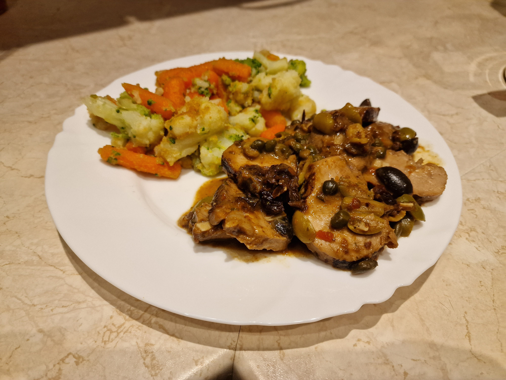

# Polędwiczka a'la Marbella

### Składniki
- 1 polędwiczka wieprzowe *(~0.5kg)*
- 80ml wina
- 50+5ml wody
- 40g oliwek zielonych *(lub mix zielonych i czarnych w stosunku 2:1)*
- 45ml śmietanki +30%
- 35g kaparów
- 30g śliwek suszonych
- 5+15ml oliwy z oliwek
- 5ml masła
- ~3g cukru
- 3ml oregano
- 3ml pietruszki naciowej
- 2 duże ząbki czosnku
- 1.5ml pieprzu *(najlepiej białego)*
- 2g skrobi
- 1ml czosnku
- 1ml lubczyku
- 1 liść laurowe
- 0.5ml chilli
- 1/4 kostki rosołowej

### Przygotowanie
1. Suche przyprawy zmielić w młynku, zmieszać z 5ml oliwy.
2. Oliwki pociąć w plasterki-ćwiartki, kapary na połówki, śliwki w kostkę 5mm.
3. Pietruszkę zsiekać, wymieszać z warzywami i śliwkami.
4. Polędwiczkę oczyścić, natrzeć przyprawami, spakować w torebkę próżniową razem z pietruszką, warzywami i śliwkami.
5. Czosnek zmielić nożem lub przez praskę, wymieszać z masłem.
6. Kostkę rosołową oraz cukier rozpuścić w 50ml wody.
7. Skrobię wymieszać w 5ml wody.

### Gotowanie
1. Mięso z dodatkami ugotować sous-vide przez 3h w 65°C.
2. Z torebki wylać sos do miski, oraz oderwać przyklejone do mięsa dodatki, odłożyć razem z sosem na bok.
3. Mięso skroić w 1.5cm plastry.
4. Na patelnię wlać pozostałą oliwę, rozgrzać na średnim ogniu; przysmażyć polędwiczki od strony cięcia aż lekko się zabrązowią.
5. Zmniejszyć ogień na niski; zalać patelnię winem i mieszać do zdeglasowania.
6. Dodać masło czosnkowe, mieszać na patelni aż roztopi się pokrywając mięso, a aromat czosnku będzie wyraźnie wyczuwalny.
7. Dolać z miski zawartość torebki, bulion oraz śmietankę, dusić przez 10min.
8. Zagęścić sos zawiesiną, dusić dodatkowe 2min mieszając kilka razy.

### Uwagi
Podawać na gorąco z gotowanymi ziemniakami, pieczonymi warzywami lub makaronem.\
Przepis daje 2-3 porcje.
