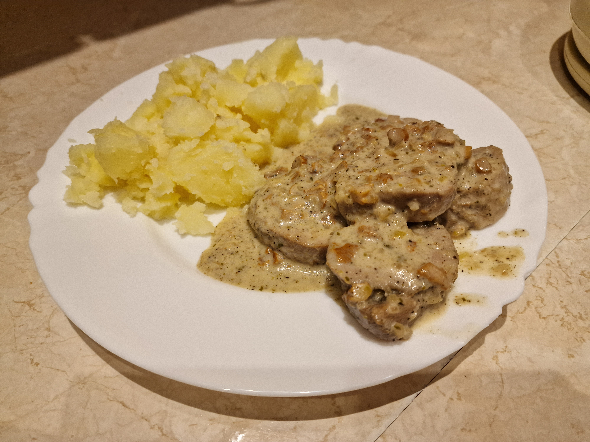

# Polędwiczki w sosie kurkowym

### Składniki
- 1 polędwiczka wieprzowa (~0.5kg)
- 125g kurek
- 100ml wina białego
- 80ml śmietany 30%
- 75g szalotki
- 50+15ml wody
- 15+15ml oliwy z oliwek
- 2 małe ząbki czosnku
- 6g skrobi ziemniaczanej
- 4g soli
- 4g pieprzu
- 3g rozmarynu
- 3g czosnku suszonego
- 3g pietruszki
- 2g tymianku
- 1/4 koski rosołowej wołowej

### Przygotowanie
1. Suche przyprawy zmielić w młynku, zmieszać z 15ml oliwy.
2. Polędwiczkę oczyścić, natrzeć przyprawami, marynować 12h w lodówce.
3. Kurki pokroić w kostkę ~5mm, szalotkę w kostkę ~2mm, czosnek zmielić nożem lub przez praskę.
4. Kostkę rosołową rozpuścić w 50ml wody.
5. Skrobię wymieszać w 15ml wody.

### Gotowanie
1. 15ml oliwy wlać na patelnię, rozgrzać na średnim ogniu; zeszklić szalotkę.
2. Zwiększyć ogień na średnio-wysoki; dodać kurki i smażyć aż do odparowania ciągle mieszając.
3. Zmniejszyć ogień na średnio-niski, dosypać czosnek i podsmażać 1 minutę ciągle mieszając.
4. Zalać całość winem i odparować większość alkoholu.
5. Dolać wywar i wymieszać.
6. Mięso oraz sos spakować w torebkę próżniową i gotować przez 3h w 65°C.
7. Sos z torebki wylać na patelnię, dodać śmietanki i zawiesiny; dokładnie wymieszać.
8. Mięso skroić w 1.5cm plastry, dodać do sosu; dusić przez 5 minut.

### Uwagi
Podawać na gorąco z gotowanymi lub pieczonymi warzywami.\
Przepis daje 2-3 porcje.
