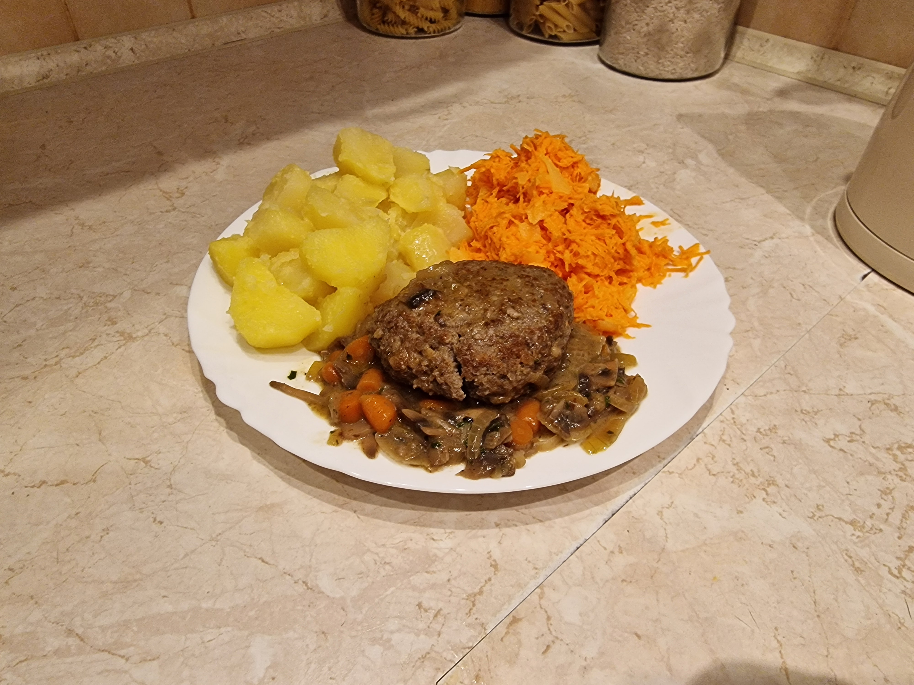

# Stek Salisbury

### Składniki
- 450g mięsa wołowo-wieprzowego
- 200ml wody
- 10 średnich pieczarek
- 4 małe cebule
- 100g baby marchewki
- 80ml bułki tartej
- 60ml smalcu
- 1 jajko
- 45ml mleka
- 30ml śmietanki +30%
- 15ml masła
- 1 kostka rosołowa wołowa
- 5ml natki pietruszki
- 4ml musztardy
- 4ml soli
- 2ml pieprzu czarnego
- 2ml majeranku
- 2ml tymianku
- 3 ziarna ziela angielskiego
- 1ml papryki wędzonej
- 1ml czosnku suszonego
- 1ml gałki muszkatołowej
- 1ml kolendry

### Przygotowanie
1. Kostkę rosołową rozpuścić w wodzie.
2. Tymianek, kolendrę i ziele angielskie zmielić w młynku, wsypać do bulionu.
3. Bułkę tartą namoczyć mlekiem, wymieszać na gładką masę.
4. Pieczarki umyć, pokroić na 2/3 kawałki (nie więcej niż 10m), a następnie w plastry.
5. Marchewki pokroić w 5mm plastry; cebulę pokroić w talarki.
6. Natkę zsiekać.

### Gotowanie
1. Mięso wymieszać z resztą przypraw, musztardą, namoczoną bułką oraz jajkiem na jednolitą masę.
2. Z masy mięsnej uformować 4 burgery grubości ok 20mm, na środku robiąc niewielkie wgłębienie aby uniknąć puchnięcia podczas kurczenia mięsa.
3. Patelnię rozgrzać na średnim ogniu; roztopić smalec i podgrzewać jeszcze 4 5sekund aby pozwolić trochę zwietrzyć zapach; podsmażać burgery ok. 4 minut na każdej stronie, lub aż zaczną odchodzić od patelni.
4. Kotlety odłożyć na talerz; na patelnię wsypać cebulę i podsmażać aż ta zmięknie (jeśli patelnia posiada grubą warstwę fond'u, to można wspomóc deglasowanie kieliszkiem wódki).
5. Dodać pieczarki, marchew i masło, podsmażać 2-3 minuty po odparowaniu wody.
6. Warzywa zalać bulionem, dodać śmietankę i natkę pietruszki.
7. Do sosu włożyć burgery i dusić na średnio-małym ogniu przez 25 minut.

### Uwagi
Przepis daje 4 porcje.\
Podawać na gorąco z ziemniakami oraz surówką lub gotowanymi warzywami.\
Burgery powinny osiągnąć temperaturę wewnętrzną 70°C, jeśli widać że mięso nie zdąży się ogrzać, to należy zwiększyć ogień / przedłużyć czas duszenia.
