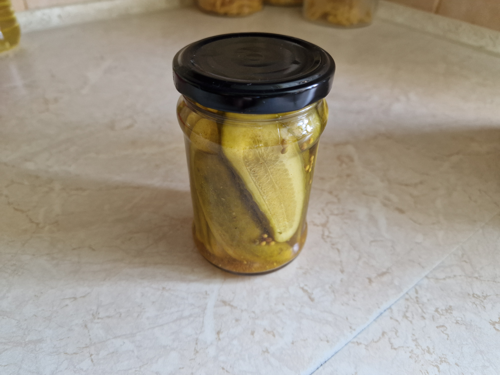

# Ogórki kanapkowe

### Składniki
- 5000g ogórków
- 1.5l wody + woda do namaczania ogórków
- 1.5l octu jabłkowego
- 1000g cukru
- 60ml soli
- 30ml gorczycy
- 25ml pieprzu kolorowego
- 15ml kurkumy
- 15ml chilli cayenne
- 15ml ziela angielskiego
- 15ml kolendry
- 5ml czosnku suszonego
- 5ml kminu

### Przygotowanie
1. Ogórki zalać całkowicie zimną wodą i namaczać przez 4-8h (w zależności on nawodnienia gleby).
2. Po namoczeniu, pokroić ogórki w 3-4mm plastry po długości.
3. Przyprawy w ziarnach należy pokruszyć (w moździerzu, młynku lub bokiem noża na desce do krojenia).

### Gotowanie
1. Ogórki ułożyć w słoikach, starając się wypełnić je ciasno, ale bez ugniatania.
2. Ocet oraz 1.5l wody wlać do dużego garnka, wsypać cukier i przyprawy, ogrzewać na niskim ogniu mieszając aż do rozpuszczenia cukru.
3. Zalewę przykryć pokrywką i podgrzewać do osiągnięcia 90-95°C - powinna wyraźnie przybrać lekko brązowy kolor od przypraw.
4. Zebrać przyprawy sitkiem, przełożyć do miseczki i wymieszać, rozłożyć po równo do słoików.
5. Rozlać zalewę po równo słoików - w razie zbraknięcia można uzupełnić octem jabłkowym.
6. Słoiki zamknąć i ułożyć w zimnym piekarniku do góry dnami, ustawić temperaturę 120°C bez termoobiegu.
7. Po nagrzaniu piekarnika, wekować na sucho słoiki przez 40min, po upłynięciu czasu wyłączyć ogrzewanie i uchylić drzwiczki na 1-2mm (włożyć metalową łyżkę u góry drzwiczek).
8. Wystudzić słoiki wewnątrz piekarnika (4-6h). Odłożyć w suche i chłodne miejsce.

### Uwagi
Ocet jabłkowy nie musi być drogi, powinien mieć jednak wyczuwalny smak fermentu jabłkowego. Zalewa powinna docelowo mieć stężenie ok. 3% kwasu octowego - w razie potrzeby można dostosować proporcje octu i wody.\
Nakrętki powinny mieć zachowany oryginalny kształt, inaczej słoiki mogą nie zawekować. W takiej sytuacji słoiki które "nie odbiły" można spróbować ponownie zawekować 1 raz po zmianie nakrętek - jednak ponowne podgrzewanie przyspieszy mięknięcie ogórków.\
Ogórki osiągają pełny smak po upływie ok 2 miesięcy, natomiast zaczynają tracić walory smakowe po upłynięciu roku (miękną i tracą strukturę). Zalewa o wyższym stężeniu kwasu octowego, nadmierne gotowanie / wekowanie, lub podwiędłe ogórki mogą ten proces przyspieszyć.
