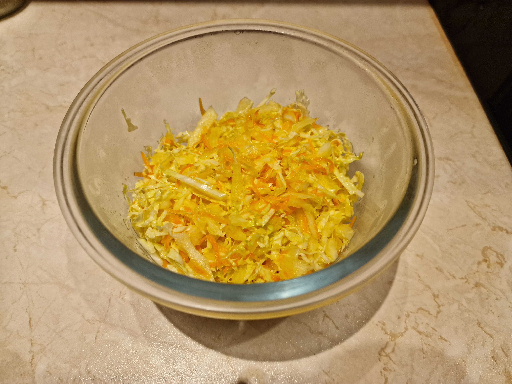

# Surówka azjatycka

### Składniki
- 1 biała kapusta lub pekińska
- 2 duże marchewki
- 100ml octu (najlepiej ryżowego)
- 70g cukru
- 50ml oliwy
- 4 ząbki czosnku
- 1 łyżka soli

### Przygotowanie
1. Kapustę drobno zsiekać (zachowując głąby), marchew zetrzeć na drobnych oczkach, czosnek zmielić nożem lub przez praskę.
2. Pozostałe składniki wlać/wsypać do rondla i podgrzać do rozpuszczenia cukru.

### Gotowanie
1. Marynatę wystudzić do letniej temperatury.
2. Warzywa zalać marynatą, dokładnie wymieszać.
3. Przed podaniem marynować w lodówce 2-12h.

### Uwagi
Surówkę można przechowywać 2-3 dni w lodówce.
Przepis daje 8-12 porcji surówki.
