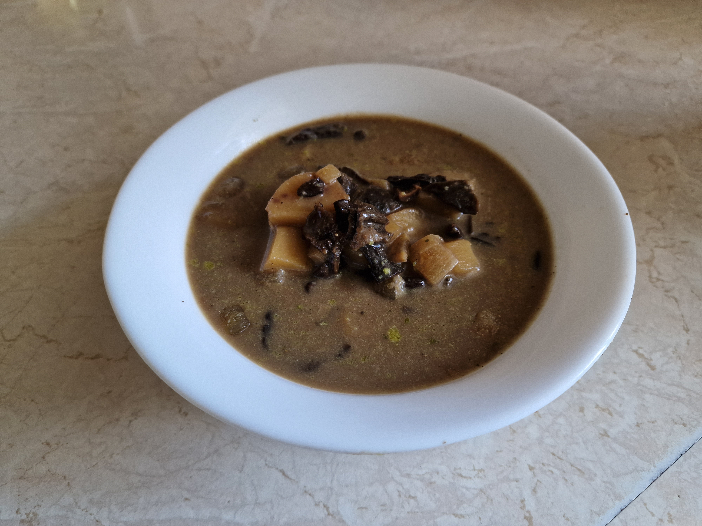

# Barszcz grzybowy

### Składniki
- 0.25+2.75l wody
- 600g ziemniaków
- 1 średnia marchewka
- 1 małą pietruszka
- 1 mała cebula
- 90g grzybów
  80ml śmietanki 30%
- 60+20ml masła
- 35ml mąki
- 10ml sosu sojowego
- 1 kostki rosołowe warzywna
- 4ml soli
- 3ml majeranku
- 3ml pieprzu
- 3ml świerzego kopru
- 3 liście laurowe
- 3 ziarna ziela angielskiego
- 1 ząbek czosnku

### Przygotowanie
1. Grzyby zsiekać w grubą, niejednorodną kostkę (najłatwiej nożyczkami, dostatecznie  suche grzyby można zwyczajnie połamać); zalać 0.25l zimnej wody i namaczać przez 4h, dociążyć talerzem, aby były pod powierzchnią wody.
2. Ziemniaki obrać, pokroić w kostkę 1.5cm; pietruszkę i marchew zetrzeć na tarce.
3. Przyprawy pokruszyć w moździerzu.
4. W 2.75l wody rozpuścić z kostkę rosołową i sos sojowy.
5. Czosnek pokroić w cienkie plasterki.

### Gotowanie
1. Cebulę przekroić na ćwiartki; przypalić palnikiem gazowym, nad płomieniem kuchenki, lub na suchej patelni.
2. Na średnim ogniu rozgrzać garnek do zupy; dodać 60ml masła, marchew oraz pietruszkę, podsmażać przez 5 minut; dodać czosnek i smażyć jeszcze 30 sekund ciągle mieszając.
3. Smażone warzywa zalać bulionem, dodać cebulę, koper oraz przyprawy; gotować wywar przez  1-2h.
4. Ziemniaki wsypać do osolonej gotującej się wody, gotować przez 15 minut.
5. Bulion odcedzić przez sitko; przełożyć do zupy grzyby, wodę z namaczania przelać przez papierowy filtr do kawy i również dodać do zupy.
6. Gotować kolejne 15 minut.
7. Na patelnię dodać pozostałe masło i mąkę; na średnim ogniu przygotować jasną zasmażkę.
8. Roztopić w zasmażce kilka łyżek zupy, mieszając trzepaczką; przygotowaną zawiesiną zagęścić zupę, dodać śmietanę i gotować jeszcze 5min.

### Uwagi
Podawać na gorąco.\
Zupa nadaje się do spożycia przez 4-5 dni, jeśli trzymana jest w lodówce.\
Dla najlepszego efektu warto używać ziemniaków sałatkowych, które nie rozpadną się w zupie.\
Przyprawy warto umieścić w torebce do herbaty - sitko może nie złapać wszystkich drobinek, natomiast filtrowanie bulionu może odrzucić tłuszcz z masła.
