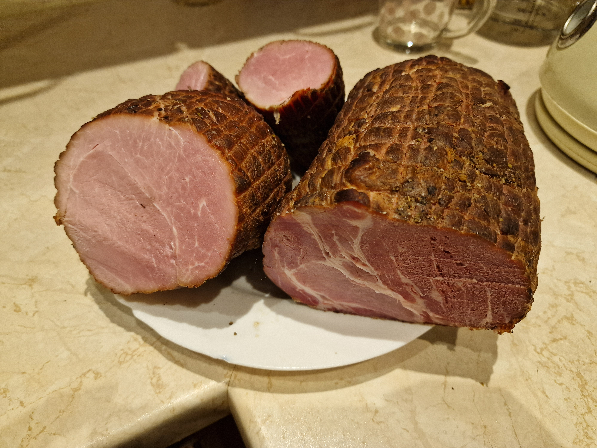

# Wędlina peklowana

### Składniki (standardowa)
- 1000ml wody
- 60g soli peklującej
- 20g cukru brązowego
- 5ml majeranku
- 5ml pieprzu (ziarna)
- 5ml czosnku (suszonego)
- 2.5ml tymianku
- 2.5ml kolendry
- 2.5ml gorczycy
- 3 ziarna ziela angielskiego
- 2 liście laurowe

### Przygotowanie
1. Wodę wlać do garnka, dodać sól pek. i cukier br., doprowadzić do wrzenia często mieszając.
2. Przyprawy w ziarnach należy pokruszyć (w moździerzu, młynku lub bokiem noża na desce do krojenia).
3. Po zagotowaniu wodę przełożyć na bardzo niski ogień (jak na rosół), dodać przyprawy i ogrzewać jeszcze 10min, mieszając 2-3 razy.
4. Przed zalaniem mięsa wystudzić zalewę.

### Gotowanie
1. Litr zalewy wystarcza na 750~1000 g mięsa.
2. Kawałki marynowanego mięsa w przekroju nie powinny być większe niż duży schab wieprzowy.
3. Peklowanie powinno się odbywać w temperaturze 5~12°C przez 7-10 dni.
4. Po peklowaniu mięso trzeba namaczać w takiej samej ilości świeżej, zimnej wody jak wcześniej zalewy (2x po 10min).
5. Mięso obrabiać termicznie:
   - Wędzić na ciepło przez 3h, następnie gotować próżniowo przez 3h w 70°C.
   - Gotować próżniowo przez 4.5h w 70°C.
   - Piec bez termoobiegu w otwartym naczyniu przez 4h w 120°C.

### Uwagi
__Sół i cukier muszą być odmierzone na wadze!__\
Nie należy stosować świeżych ziół i czosnku (mięso w miejscu styku może się popsuć).
